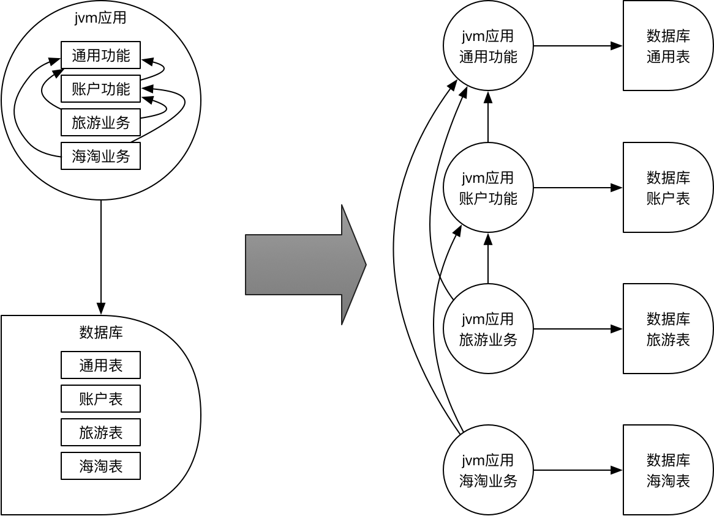

# 在生产实践中逐步构建一种基于Spring Cloud开源生态和阿里云基础设施的互联网应用架构

[点此下载本文的PDF版本](readme.pdf)

<a name="top"></a>

#### 目录

- [序言](#preface)
  - [相关技术](#technology)
  - [微服务](#microservice)
- [第一个微服务](#first-app)
  - [声明服务接口](#declare-api)
  - [实现服务接口](#implement-api)
  - [发布服务接口](#deploy-api)
  - [在开发环境启动服务](#dev-launch)
  - [生成在线接口文档](#rest-doc)
- [第二个微服务](#second-app)
  - [调用其他服务](#invoke-api)
  - [在开发环境中配置其他服务的地址](#address-api)
  - [对异常的服务熔断](#fuse)
  - [对异常的服务降级](#fallback)

<a name="preface"></a>

## 序言

笔者最近一年在某个小微创业企业工作一年有余，在人力、资金、时间等各类资源制约下从零到一完成了一个涵盖微服务、APP、WEB以及SPA应用的小型互联网应用架构。在服务端，我们主要基于Spring Cloud框架来构建微服务体系，充分运用了多项技术在开发和运维的过程中，本文对这一年的Spring Cloud框架实践，从开发到生产做一个全方面的总结。

<a name="technology"></a>

### 相关技术

`Gitlab`, `Spring Boot`, `Spring Cloud`, `Maven`, `Nexus Oss Repository`, `Mysql`, `Mybatis`, `Redis`, `Elasticsearch`, `Rabbitmq`, `Reactjs`, `阿里云`, `Consul`, `Jenkins`, `Docker`, `Docker Swarm`

<a name="microservice"></a>

### 微服务

首先需要明确一下微服务解决什么问题。

在过去，当我们既没用户又没钱也没有人才的时候，我们只能做得起所谓的单体应用，典型的单体应用由一个运行于jvm的java应用程序和一个mysql数据库构成，它们也许分别运行于不同的主机/虚拟机上，也可能运行在同一个主机/虚拟机上，所有的业务处理和用户界面都交给该应用程序，所有的数据都存储到这个唯一的数据库。

然而当用户越来越多，数据量越来越大，需要的CPU运算能力、内存占用、磁盘空间、网络带宽也在不断上升，我们可以通过增加硬件的配置来提高系统的处理能力，但硬件配置的增加有其上限（例如当前能够买到的最强性能的服务器其CPU运算能力、内存、磁盘空间是有上限的），且超过一定阙值，增加硬件配置的成本呈几何级数上升。这就需要一种架构来帮助我们拆分系统，使得系统各个部分可以运行在多个不同的硬件上，并且能够互相协作，在不损失稳定性、性能、可靠性的前提下完成原有整体功能。

为了让系统的不同部分可以运行到不同的硬件上，就需要对系统进行拆分。通常，我们可以将原先的单体应用拆分成多个单体应用，即一个jvm应用和一个数据库拆分为多个jvm应用和多个数据库，如下图所示。



我们将原先包含通用功能、账户功能、旅游业务和海淘业务的单体应用拆分为4个应用，并同时拆分原有的数据库。这样的拆分显著增加了架构的复杂性：不同业务表部署在不同的数据库内致使表连接将不再可用；原业务之间的方法调用变为网络API调用，需要考虑应用之间的网络连接、流量控制、网络延迟、网络失效等问题；应用数量的增多对运维也提出了更大挑战。

接下来，就来看看Spring Cloud框架及其生态圈如何帮助我们构建和维护这样的应用架构。

[【回到顶端】](#top)

<a name="first-app"></a>

## 第一个微服务

让我们来创建第一个微服务：common-service，一个包含了全部通用功能的微服务（日志、支付……），因为篇幅限制，仅在此演示日志功能。

最简单的方式是通过[SPRING INITIALIZR](https://start.spring.io)生成项目模板，在`Search for dependencies`输入框中输入`Cloud`，添加`Cloud Bootstrap`依赖后，点击`Generate Project`下载。

<a name="declare-api"></a>

### 声明服务接口

如前所述，服务调用是一种网络API调用，在Spring Cloud中一般为HTTP调用，通常来讲，需要我们编写客户端请求程序。但我们希望找到一种方式，可以满足如下条件：

* 由服务的实现者声明服务接口
* 服务的使用者可以清晰的查阅服务的接口说明
* 服务的使用者几乎不需要编写额外代码就可以像调用普通java方法一样调用服务
* 服务的声明可以有不同的版本

幸运的是，可以使用`Maven`和`Spring Cloud OpenFeign`来达成这样的目标，有关此话题，将在后文展开叙述，在`pom.xml`中声明`common-api`模块作为服务接口声明，声明`common-service`模块作为服务接口实现。

```xml
<!-- pom.xml -->
<?xml version="1.0" encoding="UTF-8"?>
<project xmlns="http://maven.apache.org/POM/4.0.0" xmlns:xsi="http://www.w3.org/2001/XMLSchema-instance"
    xsi:schemaLocation="http://maven.apache.org/POM/4.0.0 http://maven.apache.org/xsd/maven-4.0.0.xsd">
    <modelVersion>4.0.0</modelVersion>

    <groupId>com.github.richterplus</groupId>
    <artifactId>common</artifactId>
    <version>0.0.1-SNAPSHOT</version>
    <modules>
        <module>common-api</module>
        <module>common-service</module>
    </modules>
    <packaging>pom</packaging>

    <dependencyManagement>
        <dependencies>
            <dependency>
                <groupId>org.springframework.boot</groupId>
                <artifactId>spring-boot-dependencies</artifactId>
                <version>${spring-boot.version}</version>
                <type>pom</type>
                <scope>import</scope>
            </dependency>
            <dependency>
                <groupId>org.springframework.cloud</groupId>
                <artifactId>spring-cloud-dependencies</artifactId>
                <version>Finchley.RELEASE</version>
                <type>pom</type>
                <scope>import</scope>
            </dependency>
        </dependencies>
    </dependencyManagement>
    <properties>
        <maven.compiler.source>1.8</maven.compiler.source>
        <maven.compiler.target>1.8</maven.compiler.target>
        <project.build.sourceEncoding>UTF-8</project.build.sourceEncoding>
        <spring-boot.version>2.0.3.RELEASE</spring-boot.version>
    </properties>
</project>
```

我们在common-api模块中声明日志服务的接口

```java
//LogApi.java
package com.github.richterplus.common.api;

//省略import

/**
 * 日志API
 */
@RequestMapping("log")
public interface LogApi {

    /**
     * 添加日志记录
     */
    @ApiOperation("添加日志记录")
    @RequestMapping(method = RequestMethod.PUT, value = "append")
    AppendLogRes append(@RequestBody AppendLogReq req);
}
```

```java
//AppendLogReq.java
package com.github.richterplus.common.api.bean.log;

//省略import

/**
 * 添加日志请求
 */
public class AppendLogReq extends CommonApiReq {

    /**
     * 用户id
     */
    @ApiModelProperty(value = "用户id", required = true)
    @NotNull
    private Integer userId;

    /**
     * 日志类型
     */
    @ApiModelProperty(value = "日志类型", required = true)
    @NotNull
    private Integer logType;

    /**
     * 对象id
     */
    @ApiModelProperty(value = "对象id", required = true)
    @NotNull
    private List<Integer> objectIds;

    /**
     * 日志内容
     */
    @ApiModelProperty(value = "日志内容", required = true)
    @NotNull
    private String message;

    //省略getter和setter
}
```

```java
//AppendLogRes.java
package com.github.richterplus.common.api.bean.log;

import com.github.richterplus.common.api.bean.CommonApiRes;
import io.swagger.annotations.ApiModelProperty;

/**
 * 添加日志响应
 */
public class AppendLogRes extends CommonApiRes {

    /**
     * 日志uuid
     */
    @ApiModelProperty("日志uuid")
    private String logUuid;

    //省略getter和setter
}
```

* 使用`@RequestMapping`注解定义接口访问的url
* 使用POJO定义输入和输出
* 使用JSR303注解约束输入项
* 使用`@ApiOperation`和`@ApiModelProperty`对方法和成员进行注释（这两个是`SpringFox`注解，可用于产生接口文档，稍后会演示如何使用）

[【回到顶端】](#top)

<a name="implement-api"></a>

### 实现服务接口

让我们在common-service模块中做一个空的实现

```java
//LogApiImpl
package com.github.richterplus.common.api.impl;

//省略import

@RestController
class LogApiImpl implements LogApi {

    @Override
    public AppendLogRes append(@RequestBody @Validated AppendLogReq req) {
        return new AppendLogRes() {
            {
                setLogUuid(UUID.randomUUID().toString());
            }
        };
    }
}
```

如您所见，`LogApiImpl.append`方法直接返回一个包含随机UUID的`AppendLogRes`对象，请别着急，我们会在后面详细介绍如何完整实现该接口。

[【回到顶端】](#top)

<a name="deploy-api"></a>

### 发布服务接口

* 部署`Nexus Repository Oss 3`建立私有仓库
* 在Maven的配置文件中设定发布仓库为私有仓库
* 在`pom.xml`中配置maven-source-plugin和maven-javadoc-plugin确保源代码和javadoc的部署
* 使用mvn deploy命令发布common-api到私有仓库
* 如果您使用的是诸如IDEA之类集成开发环境，可直接在Maven Projects菜单中找到common-api模块，双击Lifecycle中的deploy即可

[【回到顶端】](#top)

<a name="dev-launch"></a>

### 在开发环境启动服务

在common-service模块的根package中放入Bootstrap类

```java
package com.github.richterplus.common;

import org.springframework.boot.SpringApplication;
import org.springframework.boot.autoconfigure.SpringBootApplication;

@SpringBootApplication
public class Bootstrap {

    public static void main(String[] args) {
        SpringApplication.run(Bootstrap.class, args);
    }
}
```

然后添加配置文件`bootstrap.yml`，将服务名称设置为common-service，端口号设置为7000

```yaml
spring:
  profiles:
    active: dev
  application:
    name: common-service

server:
  port: 7000

```

在集成开发环境中选择Bootstrap.java运行或调试即可，然后我们可以在命令行中输入curl或者使用Postman之类的工具来验证服务是否正常运行。

```shell
#使用curl命令请求服务
curl -X PUT -H 'content-type: application/json' -d '{"requestDateTime": 1530686906,"clientId": "","clientVersion": "","userId": 0,"logType": 0,"objectIds": [],"message": ""}' http://localhost:7000/log/append
```

```json
//服务正常返回数据
{
    "responseDateTime": 1531206217600,
    "logUuid": "9e479a4f-f4ee-4faa-b973-32459cb09461"
}
```

[【回到顶端】](#top)

<a name="rest-doc"></a>

### 生成在线接口文档

在`pom.xml`中增加对SpringFox的依赖

```xml
<dependency>
    <groupId>io.springfox</groupId>
    <artifactId>springfox-swagger-ui</artifactId>
    <version>${springfox-version}</version>
</dependency>
<dependency>
    <groupId>io.springfox</groupId>
    <artifactId>springfox-bean-validators</artifactId>
    <version>${springfox-version}</version>
</dependency>
```

在config包中增加一个SpringFoxConfig类

```java
//SpringFoxConfig.java
package com.github.richterplus.common.config;

//省略import

@Configuration
@EnableSwagger2
@Import(BeanValidatorPluginsConfiguration.class) //确保自动识别JSR303注解
class SpringFoxConfig {

    @Bean
    public Docket docket() {
        return new Docket(DocumentationType.SWAGGER_2)
                .select()
                .apis(RequestHandlerSelectors.withClassAnnotation(RestController.class)) //仅对包含@RestControll注解的类生成文档
                .build();
    }
}
```

请确保在对应的方法添加了`@ApiOperation`注解，在对应的属性添加了`@ApiModelProperty`注解，
启动服务后，在浏览器访问 http://localhost:7000/swagger-ui.html 即可查阅文档和模拟接口请求。

[【回到顶端】](#top)

<a name="second-app"></a>

## 第二个微服务

接下来我们构建第二个微服务：passport-service，实现注册和登录接口，并且假设注册和登录需要调用common-service来记录系统日志。

跟common-service一样，仍然定义两个模块，分别为接口声明的passport-api和接口实现的passport-service。

声明注册和登录接口：

```java
//AccountApi.java
package com.github.richterplus.passport.api;

//省略import

/**
 * 账号API
 */
@RequestMapping("account")
public interface AccountApi {

    /**
     * 注册
     */
    @ApiOperation("注册")
    @RequestMapping(method = RequestMethod.PUT, value = "register")
    RegisterAccountRes register(@RequestBody RegisterAccountReq req);
    
    /**
     * 登录
     */
    @ApiOperation("登录")
    @RequestMapping(method = RequestMethod.POST, value = "login")
    LoginRes login(@RequestBody @Validated LoginReq req);
}
```

```java
//RegisterAccountReq.java
package com.github.richterplus.passport.api.bean.account;

//省略import

/**
 * 注册账号请求
 */
public class RegisterAccountReq extends PassportApiReq {

    /**
     * 用户名
     */
    @ApiModelProperty(value = "用户名", required = true)
    @NotNull
    @Size(min = 1)
    private String username;

    /**
     * 密码
     */
    @ApiModelProperty(value = "密码", required = true)
    @NotNull
    @Size(min = 1)
    private String password;

    //省略getter和setter
}
```

```java
//RegisterAccountRes.java
package com.github.richterplus.passport.api.bean.account;

//省略import

/**
 * 注册账号响应
 */
public class RegisterAccountRes extends PassportApiRes {

    /**
     * 访问令牌
     */
    private String accessToken;

    //省略getter和setter
}
```

```java
//LoginReq.java
package com.github.richterplus.passport.api.bean.account;

//省略import

/**
 * 登录请求
 */
public class LoginReq extends PassportApiReq {

    /**
     * 用户名
     */
    @ApiModelProperty(value = "用户名", required = true)
    @NotNull
    @Size(min = 1)
    private String username;

    /**
     * 密码
     */
    @ApiModelProperty(value = "密码", required = true)
    @NotNull
    @Size(min = 1)
    private String password;

    //省略getter和setter
}
```

```java
//LoginRes.java
package com.github.richterplus.passport.api.bean.account;

//省略import

/**
 * 登录响应
 */
public class LoginRes extends PassportApiRes {

    /**
     * 访问令牌
     */
    private String accessToken;

    //省略getter和setter
}
```

[【回到顶端】](#top)

<a name="invoke-api"></a>

### 调用其他服务

我们需要在AccountApi.register及AccountApi.login方法中调用common-service的日志服务，先来看代码示例

```java
//AccountApiImpl.java
package com.github.richterplus.passport.api.impl;

//省略import

@RestController
class AccountApiImpl implements AccountApi {

    @Autowired
    private LogApi logApi;

    @Override
    public RegisterAccountRes register(@RequestBody @Validated RegisterAccountReq req) {

        logApi.append(new AppendLogReq() {
            {
                setLogType(LogType.REGISTER);
                setUserId(0);
                setObjectIds(Collections.emptyList());
                setMessage("用户【" + req.getUsername() + "】注册");
            }
        });

        return new RegisterAccountRes() {
            {
                setAccessToken(UUID.randomUUID().toString());
            }
        };
    }

    @Override
    public LoginRes login(LoginReq req) {

        logApi.append(new AppendLogReq() {
            {
                setLogType(LogType.REGISTER);
                setUserId(0);
                setObjectIds(Collections.emptyList());
                setMessage("用户【" + req.getUsername() + "】登录");
            }
        });

        return new LoginRes() {
            {
                setAccessToken(UUID.randomUUID().toString());
            }
        };
    }
}
```

如代码所示，我们直接使用@Autowire注解标记common-service中定义的LogApi实例，然后如同调用普通的类一样调用服务。

为达到此目的，需要

* 在pom.xml中添加`common-api`依赖
* 在pom.xml中添加`spring-cloud-starter-openfeign`依赖
* 添加`@EnableFeignClients`注解到应用程序配置类，在本示例中直接添加到Bootstrap类
* 添加一个用`@FeignClient`注解的继承自`LogApi`的接口，如下所示：

```java
package com.github.richterplus.passport.service;

//省略import

@FeignClient(name = "common-service")
interface LogService extends LogApi { }
```

[【回到顶端】](#top)

<a name="address-api"></a>

### 在开发环境中配置其他服务的地址

在生产环境中，使用基于consul的服务注册与发现来找到服务的地址，但在开发环境中，往往希望能由开发人员自行指定特定服务的地址（例如经常需要调试某位开发人员机器上特定开发版本的某个服务）。因此，我们在开发环境禁用了服务注册与发现，并且在yml配置文件中自行配置其他服务的地址，如下所示：

```yaml
#bootstrap-dev.yml
spring:
  cloud:
    consul:
      enabled: false #禁用consul的服务注册与发现

common-service: #与@FeignClient注解的name属性以及common-service配置的spring.application.name保持一致
  ribbon:
    listOfServers: localhost:7000 #配置common-service的负载均衡列表
```

现在让我们来启动passport-service和common-service，然后使用Postman或者curl命令请求注册接口

```shell
#使用curl命令请求服务
curl -X PUT -H 'content-type: application/json' -d '{"username": "richterplus","password": "111111"}' http://localhost:7001/account/register
```

[【回到顶端】](#top)

<a name="fuse"></a>

### 对异常的服务熔断

先以AccountApi.register以及AccountApi.login接口中调用LogApi.append服务的例子来说明什么是熔断。

假设由于服务超负荷、硬件故障等各种原因，日志服务响应缓慢，此时又有大量的并发注册登录请求发送到passport-service。我们知道，注册和登录需要调用日志服务才能完成，而由于日志服务响应缓慢，则大量的注册和登录请求都在等待日志服务的响应，随着时间的推移，大量挂起的请求造成passport-service过载，但实际上passport-service并没有过错，而是受到了日志服务的拖累。

更一般的情况，在实际的系统中，往往由多达数个或者数十个服务形成调用链，链条上任一节点的过载将直接影响所有后续节点，从而造成整个链路的不可用，这是难以接受的，因此需要引入服务熔断。

还是以passport-service为例，是不是可以引入一种机制，使得passport-service发现日志服务过载时，在一段时间内不再请求日志服务，从而对自身形成保护？答案是肯定的。我们在请求其他服务时所用的@FeignClient已经涵盖此特性，默认情况下，在`10秒`内超过`20次请求`的前提下，有`50%`的请求失败则认为服务不可用，此时触发熔断，将不再请求服务。以passport-service为例，则可以理解为在10秒有超过20次对common-service请求的前提下，如果存在超过50%的失败，则任何对common-service的请求将不再发送到common-service。

那失败是如何定义的？除了常规的连接失败及4xx、5xx异常外，Feign也能自定义connectTimeout（连接超时）和readTimeout（读取超时），默认的超时都是1秒。

现在我们修改common-service的LogApi.append代码，把处理时间加长到4秒以上。

```java
package com.github.richterplus.common.api.impl;

//省略import

@RestController
class LogApiImpl implements LogApi {

    @Override
    public AppendLogRes append(@RequestBody @Validated AppendLogReq req) {

        try {
            Thread.sleep(4000);
        } catch (InterruptedException e) {
            throw new RuntimeException(e);
        }

        return new AppendLogRes() {
            {
                setLogUuid(UUID.randomUUID().toString());
            }
        };
    }
}
```

使用Postman或者curl命令请求注册接口，返回500状态码，异常信息为ReadTimeout，可以修改connectTimeout和readTimeout，但一般情况下不建议这么做（原因请看上方有关熔断的说明）。我们在passport-service模块的bootstrap.yml文件中修改readTimeout。

```yaml
common-service:
  ribbon:
    ReadTimeout: 5000
```

再次使用Postman或者curl命令请求注册接口，可以看到正常返回。

[【回到顶端】](#top)

<a name="fallback"></a>

### 对异常的服务降级

以passport-service的注册和登录请求common-service的日志为例，假设common-service过载触发了passport-service熔断，那么所有对注册和登录的请求都将失败，虽然起到了保护passport-service的作用，但注册和登录功能却不可用了，这可能不是我们希望的。由于注册和登录时对common-service的依赖仅仅是记录日志，未及时记录甚至是漏记其实都是可以接受的，那是否可以在common-service不可用时，为日志功能提供一个降级的实现？例如一个本地的日志缓存队列或者直接丢弃对日志的记录。

[【回到顶端】](#top)

